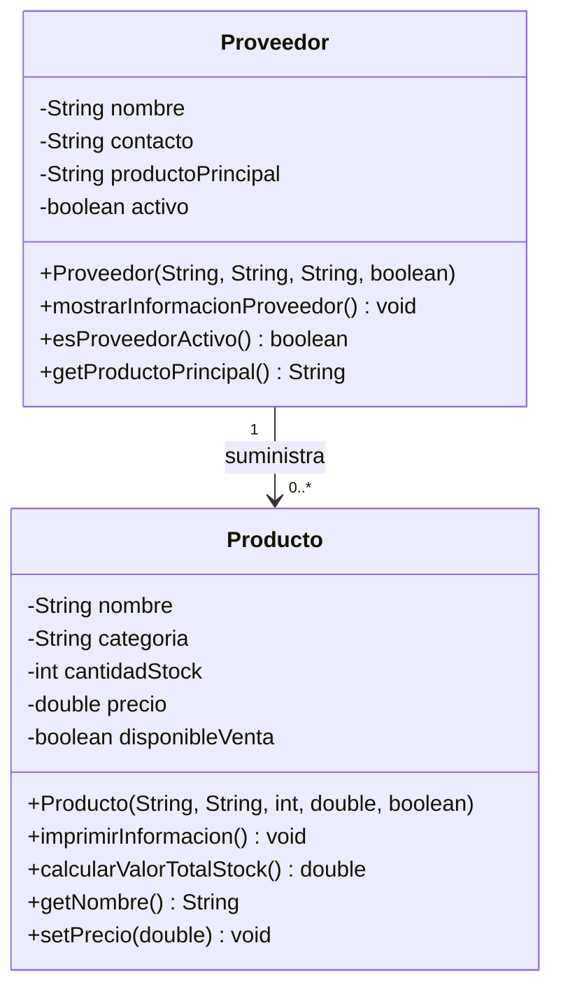

# Análisis Orientado a Objetos - Ferretería Construye Fácil

## 1. Identificación del Dominio

**Nombre del negocio:** Construye Fácil  
**Tipo:** Ferretería y Materiales de Construcción  
**Descripción:** Negocio especializado en herramientas, materiales de construcción, pinturas y artículos eléctricos, con 12 empleados y clientela variada que incluye constructores, maestros de obra y público general.

## 2. Objetos Identificados

### Objeto Principal: Producto
**¿Qué es?:** Representa los artículos que se venden en la ferretería, cada uno con sus características específicas.  
**Atributos identificados:**
- `nombre: String` - Nombre comercial del producto
- `categoria: String` - Tipo de producto (herramientas, materiales, pinturas, eléctricos)
- `cantidadStock: int` - Unidades disponibles en inventario
- `precio: double` - Valor de venta al público
- `disponibleVenta: boolean` - Indica si el producto está activo para la venta

**Métodos identificados:**
- `imprimirInformacion(): void` - Muestra en consola todos los datos del producto
- `calcularValorTotalStock(): double` - Calcula el valor monetario total del stock disponible
- `getNombre(): String` - Obtiene el nombre del producto
- `setPrecio(double): void` - Modifica el precio del producto con validación

### Objeto Secundario: Proveedor
**¿Qué es?:** Representa a las empresas que suministran productos a la ferretería.  
**Atributos identificados:**
- `nombre: String` - Nombre de la empresa proveedora
- `contacto: String` - Teléfono o email para comunicación
- `productoPrincipal: String` - Tipo principal de productos que suministra
- `activo: boolean` - Estado actual de la relación comercial

**Métodos identificados:**
- `mostrarInformacionProveedor(): void` - Despliega la información completa del proveedor
- `esProveedorActivo(): boolean` - Verifica si el proveedor está activo
- `getProductoPrincipal(): String` - Obtiene el producto principal que suministra

## 3. Relación entre Objetos

**Tipo de relación:** Asociación  
**Descripción:** Un Proveedor puede suministrar múltiples Productos a la ferretería. Cada Producto puede provenir de uno o más Proveedores, pero en este modelo básico se establece una relación indirecta a través del atributo "productoPrincipal". Los Proveedores son fundamentales para mantener el stock de Productos disponible.

## 4. Justificación del Diseño

**¿Por qué elegí estos objetos?**  
El Producto es el núcleo del negocio ferretero ya que representa lo que se comercializa. El Proveedor es esencial porque sin suministros no hay productos para vender. Esta relación es básica para la operación del negocio.

**¿Por qué estos atributos son importantes?**
- **Para Producto:** El stock y precio son críticos para la gestión de inventario y ventas. La categoría ayuda en la organización. La disponibilidad evita vender productos discontinuados.
- **Para Proveedor:** El contacto es vital para pedidos. El estado activo/inactivo permite gestionar relaciones comerciales. El producto principal ayuda en la búsqueda de proveedores específicos.

**¿Por qué estos métodos son necesarios?**
- Los métodos de impresión permiten visualizar información rápidamente.
- El cálculo de valor total del stock es crucial para el inventario valorado.
- Los getters/setters mantienen el encapsulamiento y permiten validaciones.
- El método para verificar actividad del proveedor ayuda en la toma de decisiones de compra.

## 5. Comparación: POO vs Programación Estructurada

**Sin POO (Estructurado):**  
Se usarían variables independientes para cada producto: `nombreProducto1`, `precioProducto1`, `stockProducto1`, etc. Las operaciones se harían con funciones que reciben muchos parámetros. No habría encapsulamiento y sería difícil manejar múltiples productos de forma organizada. Los datos del proveedor estarían separados sin relación clara con los productos.

**Con POO:**  
Cada Producto es un objeto autocontenido con sus datos y comportamientos. Se pueden crear listas de productos fácilmente. La relación con Proveedores queda establecida conceptualmente. El código es más modular, reutilizable y fácil de mantener.

**Ventajas específicas en mi dominio:**
1. **Escalabilidad:** Se pueden añadir fácilmente nuevos productos o proveedores sin modificar la estructura existente
2. **Organización:** Cada producto mantiene su información agrupada lógicamente
3. **Mantenimiento:** Cambiar la lógica de un producto no afecta a los demás
4. **Simulación realista:** Representa fielmente cómo opera una ferretería real

## 6. Diagrama de Clases

